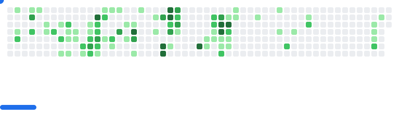

<!-- Capa -->

  
  <b>`开发人员云`</b>
  <samp>
       
      Hi there! I'm <b>Otto Samuel</b>
  </samp>

<!-- Mensagem animada -->

  

  <!-- Estatísticas principais -->
  
  
  
  
   
   
  

 

  &nbsp;&nbsp;
 &nbsp;&nbsp;

 
<!-- Skills -->

  

<!-- Contribuições -->

  

<!-- GIF -->

  

<!-- Activity Graph -->

  

  
  
  
  

 
<!-- Troféus -->

  

<!-- Breakout Game -->

  <picture>
    <source media="(prefers-color-scheme: dark)" srcset="images/breakout-dark.svg" />
    <source media="(prefers-color-scheme: light)" srcset="images/breakout-light.svg" />
    
  </picture>

<!-- Final Footer -->

