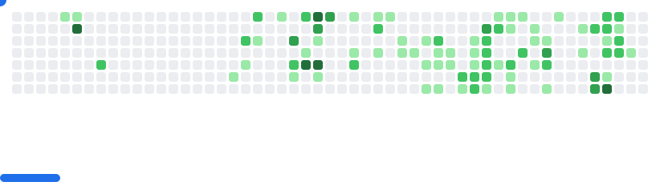

<!-- Capa -->

  
  <b>`开发人员云`</b>
  <samp>
       
      Hi there! I'm <b>Otto Samuel</b>
  </samp>

<!-- Mensagem animada -->

  

  <!-- Estatísticas principais -->
  
  
  
  
  
  
  
   
   
  

 

  
 
  

 

<!-- Skills (table layout to keep two columns side-by-side) -->
<table align="center"
       style="max-width:1100px; width:100%; border-collapse:collapse; border-spacing:0; border:None;">
  <tr>
    <!-- left column: Techs + Badges -->
    <td style="vertical-align:top; padding:12px 24px 12px 12px; width:60%; border:none;">
      <h3 style="margin-top:-2px;margin:6px 0 12px 6px; font-weight:300; font-size:28px; color:#e6e6e6;">Technologies</h3>

  

  <h3 style="margin:6px 0 12px 6px; font-weight:300; font-size:28px; color:#e6e6e6;">Badges</h3>
  

        
        
        
      

    </td>
<!-- right column: daily.dev card -->
    <td style="vertical-align:top; padding:12px 12px 12px 24px; width:40%; border:none;">
      

        
      

    </td>
  </tr>
</table>
<!-- Contribuições -->

  

<!-- GIF -->

  

<!-- Activity Graph -->

  

  
  
  
  
  

 
<!-- Troféus -->

  

<!-- Breakout Game -->

  <picture>
    <source media="(prefers-color-scheme: dark)" srcset="images/breakout-dark.svg" />
    <source media="(prefers-color-scheme: light)" srcset="images/breakout-light.svg" />
    
  </picture>

<!-- Final Footer -->

